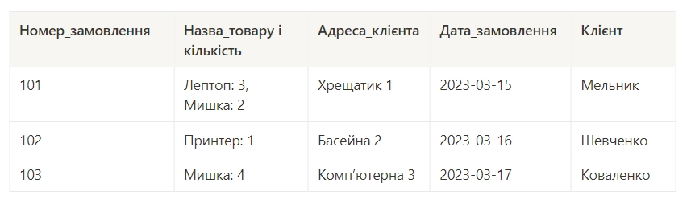
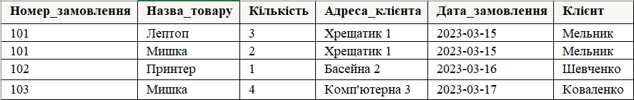
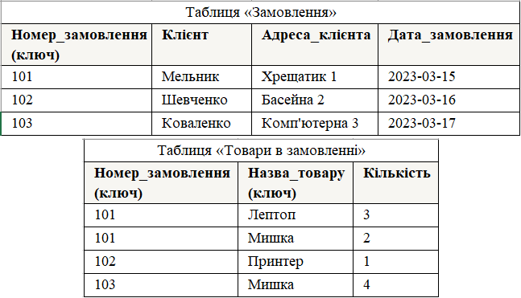
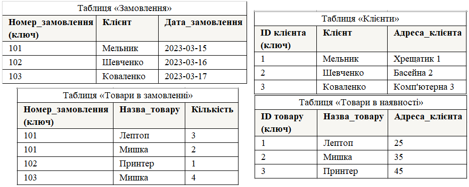
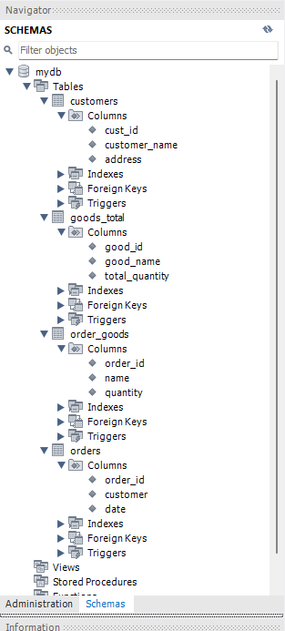

# Тема 2. Проектування баз даних з використанням семантичних моделей

## Початкова таблиця

## Перша нормалізована форма

## Друга нормалізована форма

## Третя нормалізована форма

## ER-діаграма отриманих таблиць

## Таблиці в базі даних

